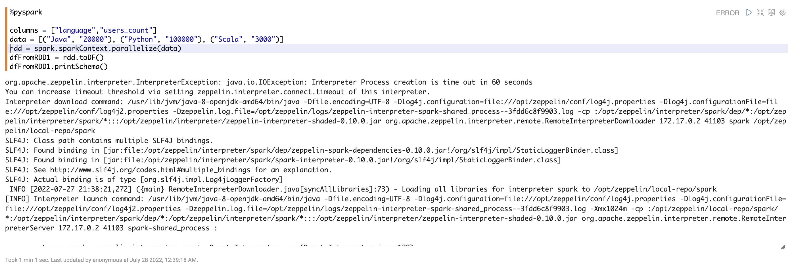
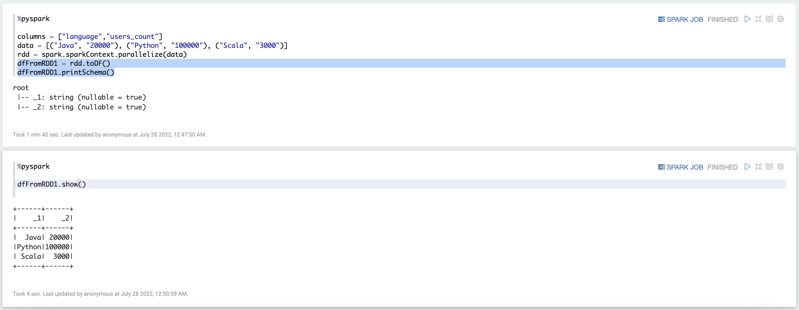

# Compiling Spark code using Apache Zeppelin in Docker


# Problem

If you pulled Docker image of Apache Spark like this:

```jsx
docker pull apache/zeppelin:0.10.0
```

Specified port and run this image in container. Then opened Apache Zeppelin in browser and tried to compile some spark code, you might have got some of the following errors:

`org.apache.zeppelin.interpreter.InterpreterException: java.io.IOException: Interpreter Process creation is time out in 60 seconds`

```jsx
org.apache.zeppelin.interpreter.InterpreterException: java.io.IOException: Interpreter Process creation is time out in 60 seconds
You can increase timeout threshold via setting zeppelin.interpreter.connect.timeout of this interpreter.
Interpreter download command: /usr/lib/jvm/java-8-openjdk-amd64/bin/java -Dfile.encoding=UTF-8 -Dlog4j.configuration=file:///opt/zeppelin/conf/log4j.properties -Dlog4j.configurationFile=file:///opt/zeppelin/conf/log4j2.properties -Dzeppelin.log.file=/opt/zeppelin/logs/zeppelin-interpreter-spark-shared_process--3fdd6c8f9903.log -cp :/opt/zeppelin/interpreter/spark/dep/*:/opt/zeppelin/interpreter/spark/*:::/opt/zeppelin/interpreter/zeppelin-interpreter-shaded-0.10.0.jar org.apache.zeppelin.interpreter.remote.RemoteInterpreterDownloader 172.17.0.2 41103 spark /opt/zeppelin/local-repo/spark
SLF4J: Class path contains multiple SLF4J bindings.
SLF4J: Found binding in [jar:file:/opt/zeppelin/interpreter/spark/dep/zeppelin-spark-dependencies-0.10.0.jar!/org/slf4j/impl/StaticLoggerBinder.class]
SLF4J: Found binding in [jar:file:/opt/zeppelin/interpreter/spark/spark-interpreter-0.10.0.jar!/org/slf4j/impl/StaticLoggerBinder.class]
SLF4J: See http://www.slf4j.org/codes.html#multiple_bindings for an explanation.
SLF4J: Actual binding is of type [org.slf4j.impl.Log4jLoggerFactory]
 INFO [2022-07-27 21:38:21,272] ({main} RemoteInterpreterDownloader.java[syncAllLibraries]:73) - Loading all libraries for interpreter spark to /opt/zeppelin/local-repo/spark
[INFO] Interpreter launch command: /usr/lib/jvm/java-8-openjdk-amd64/bin/java -Dfile.encoding=UTF-8 -Dlog4j.configuration=file:///opt/zeppelin/conf/log4j.properties -Dlog4j.configurationFile=file:///opt/zeppelin/conf/log4j2.properties -Dzeppelin.log.file=/opt/zeppelin/logs/zeppelin-interpreter-spark-shared_process--3fdd6c8f9903.log -Xmx1024m -cp :/opt/zeppelin/local-repo/spark/*:/opt/zeppelin/interpreter/spark/dep/*:/opt/zeppelin/interpreter/spark/*:::/opt/zeppelin/interpreter/zeppelin-interpreter-shaded-0.10.0.jar org.apache.zeppelin.interpreter.remote.RemoteInterpreterServer 172.17.0.2 41103 spark-shared_process :

	at org.apache.zeppelin.interpreter.remote.RemoteInterpreter.open(RemoteInterpreter.java:129)
	at org.apache.zeppelin.interpreter.remote.RemoteInterpreter.getFormType(RemoteInterpreter.java:271)
	at org.apache.zeppelin.notebook.Paragraph.jobRun(Paragraph.java:440)
	at org.apache.zeppelin.notebook.Paragraph.jobRun(Paragraph.java:71)
	at org.apache.zeppelin.scheduler.Job.run(Job.java:172)
	at org.apache.zeppelin.scheduler.AbstractScheduler.runJob(AbstractScheduler.java:132)
	at org.apache.zeppelin.scheduler.RemoteScheduler$JobRunner.run(RemoteScheduler.java:182)
	at java.util.concurrent.Executors$RunnableAdapter.call(Executors.java:511)
	at java.util.concurrent.FutureTask.run(FutureTask.java:266)
	at java.util.concurrent.ScheduledThreadPoolExecutor$ScheduledFutureTask.access$201(ScheduledThreadPoolExecutor.java:180)
	at java.util.concurrent.ScheduledThreadPoolExecutor$ScheduledFutureTask.run(ScheduledThreadPoolExecutor.java:293)
	at java.util.concurrent.ThreadPoolExecutor.runWorker(ThreadPoolExecutor.java:1149)
	at java.util.concurrent.ThreadPoolExecutor$Worker.run(ThreadPoolExecutor.java:624)
	at java.lang.Thread.run(Thread.java:748)
Caused by: java.io.IOException: Interpreter Process creation is time out in 60 seconds
```

or

`org.apache.zeppelin.interpreter.InterpreterException: java.io.IOException: Interpreter process is not running`

```jsx
org.apache.zeppelin.interpreter.InterpreterException: java.io.IOException: Interpreter process is not running
Interpreter download command: /usr/lib/jvm/java-8-openjdk-amd64/bin/java -Dfile.encoding=UTF-8 -Dlog4j.configuration=file:///opt/zeppelin/conf/log4j.properties -Dlog4j.configurationFile=file:///opt/zeppelin/conf/log4j2.properties -Dzeppelin.log.file=/opt/zeppelin/logs/zeppelin-interpreter-spark-shared_process--3fdd6c8f9903.log -cp :/opt/zeppelin/interpreter/spark/dep/*:/opt/zeppelin/interpreter/spark/*:::/opt/zeppelin/interpreter/zeppelin-interpreter-shaded-0.10.0.jar org.apache.zeppelin.interpreter.remote.RemoteInterpreterDownloader 172.17.0.2 41103 spark /opt/zeppelin/local-repo/spark
SLF4J: Class path contains multiple SLF4J bindings.
SLF4J: Found binding in [jar:file:/opt/zeppelin/interpreter/spark/dep/zeppelin-spark-dependencies-0.10.0.jar!/org/slf4j/impl/StaticLoggerBinder.class]
SLF4J: Found binding in [jar:file:/opt/zeppelin/interpreter/spark/spark-interpreter-0.10.0.jar!/org/slf4j/impl/StaticLoggerBinder.class]
SLF4J: See http://www.slf4j.org/codes.html#multiple_bindings for an explanation.
SLF4J: Actual binding is of type [org.slf4j.impl.Log4jLoggerFactory]
 INFO [2022-07-27 21:38:21,272] ({main} RemoteInterpreterDownloader.java[syncAllLibraries]:73) - Loading all libraries for interpreter spark to /opt/zeppelin/local-repo/spark
[INFO] Interpreter launch command: /usr/lib/jvm/java-8-openjdk-amd64/bin/java -Dfile.encoding=UTF-8 -Dlog4j.configuration=file:///opt/zeppelin/conf/log4j.properties -Dlog4j.configurationFile=file:///opt/zeppelin/conf/log4j2.properties -Dzeppelin.log.file=/opt/zeppelin/logs/zeppelin-interpreter-spark-shared_process--3fdd6c8f9903.log -Xmx1024m -cp :/opt/zeppelin/local-repo/spark/*:/opt/zeppelin/interpreter/spark/dep/*:/opt/zeppelin/interpreter/spark/*:::/opt/zeppelin/interpreter/zeppelin-interpreter-shaded-0.10.0.jar org.apache.zeppelin.interpreter.remote.RemoteInterpreterServer 172.17.0.2 41103 spark-shared_process :

	at org.apache.zeppelin.interpreter.remote.RemoteInterpreter.open(RemoteInterpreter.java:129)
	at org.apache.zeppelin.interpreter.remote.RemoteInterpreter.getFormType(RemoteInterpreter.java:271)
	at org.apache.zeppelin.notebook.Paragraph.jobRun(Paragraph.java:440)
	at org.apache.zeppelin.notebook.Paragraph.jobRun(Paragraph.java:71)
	at org.apache.zeppelin.scheduler.Job.run(Job.java:172)
	at org.apache.zeppelin.scheduler.AbstractScheduler.runJob(AbstractScheduler.java:132)
	at org.apache.zeppelin.scheduler.RemoteScheduler$JobRunner.run(RemoteScheduler.java:182)
	at java.util.concurrent.Executors$RunnableAdapter.call(Executors.java:511)
	at java.util.concurrent.FutureTask.run(FutureTask.java:266)
	at java.util.concurrent.ScheduledThreadPoolExecutor$ScheduledFutureTask.access$201(ScheduledThreadPoolExecutor.java:180)
	at java.util.concurrent.ScheduledThreadPoolExecutor$ScheduledFutureTask.run(ScheduledThreadPoolExecutor.java:293)
	at java.util.concurrent.ThreadPoolExecutor.runWorker(ThreadPoolExecutor.java:1149)
	at java.util.concurrent.ThreadPoolExecutor$Worker.run(ThreadPoolExecutor.java:624)
	at java.lang.Thread.run(Thread.java:748)
```

or 

`org.apache.thrift.transport.TTransportException: java.net.ConnectException: Connection refused at`



This means that Zeppelin starts the interpreter in a different process and having difficulties  connecting to this process using Thrift Protocol or simply failed to start the interpreter process. This might happen for many reasons and one of them is incorrectly set `$SPARK_HOME` path variable.


# Solution

The easy fix for the issue described above:

1. Go to <your name> (top right corner in Zeppelin app in browser) > Interpreter
2. Find spark interpreter
3. Set value of property `spark.executor.memory` to `512m`
4. Save changes and restart the interpreter 

Now try to compile spark code. The first compilation might take long time but the next one is going to work faster. 




	
# How it works
	
This manipulation probably redefines some spark properties that are necessary to run the interpreter by making request to spark interpreter API. If you look at log of the container you can find the following line:

`INFO [2022-07-27 21:46:02,791] ({qtp230528013-28} InterpreterRestApi.java[updateSetting]:156) - Update interpreterSetting spark`

There’s no more further information about this operation in log file, so it’s hard to determine which variables has been changed. Moreover, if you run your spark application locally as I do (`spark.master = local[*]`) , your spark application makes all its calculations on the driver and doesn’t use executors. This means that changing value of property `spark.executor.memory` doesn’t even affect anything. So, this is probably the Zeppelin bug.
